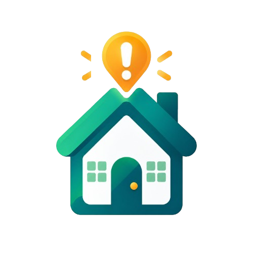

  

<h1 align="center">HouseFlow</h1>

<strong>Sua casa, seu time.</strong>

Organização doméstica, colaboração e gamificação para quem divide uma casa.

<a href="https://hqlcc.github.io/tccLanding/">Acesse a landing page</a>

Sobre o projeto
O HouseFlow é uma proposta de plataforma para ajudar pessoas que compartilham uma residência a organizar as tarefas domésticas e acompanhar o cuidado com os espaços comuns. O público inicial são jovens adultos e moradores de repúblicas, que precisam conciliar rotinas diferentes e dividir responsabilidades no dia a dia.
A ideia é reunir tarefas, prioridades e contribuições em uma experiência compartilhada, com elementos de gamificação que tornem o progresso mais visível. Atividades como lavar a louça, tirar o lixo ou limpar a cozinha podem se transformar em missões, conectadas à evolução dos moradores e da própria casa.
O projeto nasce como um Trabalho de Conclusão de Curso em Sistemas de Informação na ESPM, com a intenção de continuar seu desenvolvimento para além da entrega acadêmica. O objetivo de longo prazo é construir um produto profissional, útil e sustentável, orientado pelas necessidades de seus usuários.
O problema que queremos abordar
Dividir uma casa também significa dividir o trabalho necessário para mantê-la organizada. Sem acordos claros e uma forma de acompanhar as atividades, algumas tarefas podem ser esquecidas, outras podem se acumular e determinados moradores podem assumir mais responsabilidades do que os demais.
O HouseFlow busca facilitar essa coordenação: ajudar o grupo a entender o que precisa ser feito, reconhecer as contribuições de cada pessoa e cuidar dos ambientes de maneira coletiva.
A proposta
A plataforma está sendo pensada em torno de três frentes:

- Organização compartilhada: registrar ambientes e tarefas, estabelecer prioridades e acompanhar responsabilidades e atividades concluídas.
- Gamificação colaborativa: explorar missões, pontos de experiência, conquistas e metas que reconheçam a participação individual e incentivem o cuidado coletivo.
- Mapa de Atenção: representar visualmente os ambientes da residência para indicar quais precisam de maior cuidado, considerando informações como tarefas pendentes, periodicidade e atrasos.
  A finalidade é tornar a rotina mais compreensível e estimular a colaboração. As mecânicas e regras da plataforma serão refinadas durante o desenvolvimento e a avaliação com potenciais usuários.
  Do TCC a um produto profissional
  O contexto acadêmico oferece uma oportunidade para investigar o problema, levantar requisitos, desenvolver a solução e avaliar sua utilidade. Esse processo também deve orientar as decisões sobre a evolução do HouseFlow.
  Queremos que o projeto tenha continuidade e possa se tornar uma solução utilizada em situações reais. Para isso, pretendemos amadurecer a experiência de uso, a acessibilidade, a segurança, a privacidade e a qualidade técnica, além de estudar a viabilidade de operação do produto.
  Essa é uma direção de desenvolvimento. O escopo da primeira versão, o modelo de negócio e uma eventual disponibilização comercial ainda precisam ser definidos e validados.
  Sobre este repositório
  Este repositório contém a landing page do HouseFlow, criada para apresentar o conceito, a identidade visual e exemplos da experiência proposta.
  A página inclui:
- apresentação da ideia e de seus principais recursos;
- demonstração interativa do Mapa de Atenção;
- exemplo de conclusão de uma missão;
- representação do progresso e das contribuições dos moradores;
- logo, mascotes e avatares do projeto;
- layout responsivo e alternância entre os modos claro e escuro, com a preferência salva no navegador.
  Os dados, as pontuações e as interações apresentados são demonstrativos. A landing não implementa a plataforma completa: não oferece cadastro de usuários, gerenciamento real de residências ou armazenamento das tarefas em um servidor. A conclusão de missões e a seleção de ambientes servem para explorar o conceito da interface.
  Tecnologias
  Tecnologia Uso
  React Componentes e interações da interface
  Vite Ambiente de desenvolvimento e geração do build
  CSS Identidade visual, responsividade e temas
  Lucide React Ícones da interface
  GitHub Actions Automação do build e da publicação
  GitHub Pages Hospedagem da landing page

Executar localmente
Utilize Node.js 22.12 ou superior, compatível com a versão do Vite utilizada no projeto, e npm.
git clone https://github.com/hqlcc/tccLanding.git
cd tccLanding
npm install
npm run dev
Abra o endereço exibido no terminal. O projeto utiliza o caminho base /tccLanding/ para ser publicado no GitHub Pages.
Para gerar e conferir a versão de produção:
npm run build
npm run preview
O build será gerado em dist. O comando preview permite verificar esse resultado localmente.
Organização dos arquivos
Caminho Conteúdo
src/app.jsx Seções e componentes da landing
src/main.jsx Inicialização da aplicação React
src/styles.css Estilos, temas e regras de responsividade
src/assets/brand/ Logo e elementos da marca
src/assets/avatars/ Avatares da demonstração
src/assets/mascots/ Ilustrações dos mascotes
index.html Documento de entrada e configuração inicial do tema
vite.config.js Configuração do Vite e do caminho base
.github/workflows/deploy.yml Workflow de publicação

Publicação
A landing está disponível em hqlcc.github.io/tccLanding.
O GitHub Pages deve utilizar GitHub Actions como fonte de publicação, em Settings → Pages → Build and deployment → Source. O workflow gera a versão de produção e publica o conteúdo de dist após alterações na branch main.
As pastas node_modules e dist não devem ser versionadas. As dependências e os arquivos de produção são gerados durante a instalação e o build.
Próximos passos
As próximas etapas previstas incluem aprofundar a pesquisa com o público, definir o escopo de um produto mínimo viável, desenvolver as funcionalidades centrais e avaliar a experiência com usuários. Os resultados dessas etapas devem orientar a continuidade do projeto e a análise de sua viabilidade como produto.
Sugestões sobre a proposta e relatos de dificuldades encontradas na landing são bem-vindos por meio das issues deste repositório.
